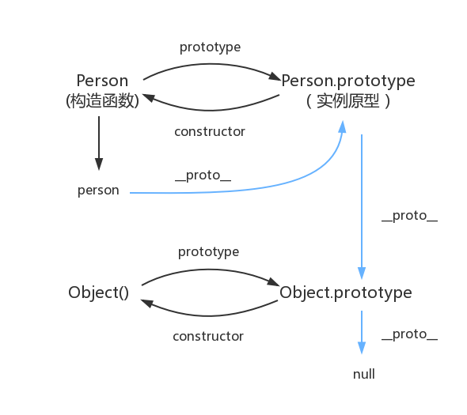

### ES6 新特性

- let const 关键字
- 函数默认参数
- 箭头函数
- 摸板字符串
- 扩展运算符 解构赋值 对象字面量简化
- 类 模块化
- promise（all，race，any） async await
- map set
- 迭代器（iterator generator）
- proxy 代理 reflect 反射
- 数组（includes、flat、from、find、fill）、对象（assign、getPrototypeOf、**proto**方法）、字符串的扩展（includes、startsWith、repeat）

### AST 抽象语法树

> 它是源代码语法结构的一种抽象表示

- AST 生成：js 执行的第一步是读取 js 文件中的字符流，然后通过词法分析生成 token，之后再通过语法分析( Parser )生成 AST，最后生成机器码执行。
- 词法分析：每个关键字是一个 token，每个标识符，操作符也是一个 token，例如 var 这三个字符，语义上不能再被分解。注释和空白字符会被过滤掉。 整个代码最终会被分割进一个 tokens 列表。
- 语法分析：将词法分析出来的 tokens 转化为有语法含义的抽象树结构。

**AST 运用广泛**：

1. 编辑器的错误提示、代码格式化、代码高亮、代码自动补全；
2. elint、pretiier 对代码错误或风格的检查；
3. webpack 通过 babel 转译 javascript 语法；

### 闭包

> 在 JavaScript 中，函数即闭包，只有函数才会产生作用域。（函数被引用包围）简单理解：函数 A 返回了一个函数 B，并且函数 B 中使用了函数 A 的变量，函数 B 就被称为闭包。 闭包: 有权访问另一个函数作用域中的变量的函数。

- 作用：使用闭包主要是为了设计私有的方法和变量。
- 优缺点：闭包的优点是可以避免全局变量的污染；缺点是闭包会常驻内存，增加内存的使用量，使用不当很容易
  造成内存泄漏。
- 闭包有 3 个特性：
  （1）函数嵌套函数
  （2）在函数内部可以引用外部的参数和变量
  （3）参数和变量不会被垃圾回收机制回收
- 使用场景：

```js
1、函数防抖
2、设置私有变量
3、函数作为参数
4、拿到正确的值：
for(var i=0;i<10;i++){
    setTimeout(function(){
        console.log(i)//10个10
    },1000)
}

for(var i=0;i<10;i++){
((j)=>{
  setTimeout(function(){
        console.log(j)//1-10
    },1000)})(i)

}
```

### 说说 JavaScript 中内存泄漏的几种情况

1. 意外的全局变量 （可使用严格模式避免）
2. 定时器
3. 闭包
4. 事件监听，不使用时未取消监听

### 原型和原型链

##### 原型

原型就是把公共的方法和属性放在函数的原型对象 prototype 上 原型链就是实例对象上面会有一个私有属性**proto**，这个属性会指向原型对象 prototype，让实例对象也能拥有原型对象的方法和属性，同时原型对象的**proto**会指向父一级的原型对象，最终指向 null

- 在 JavaScript 中，每当定义一个函数数据类型(普通函数、类)时候，都会天生自带一个 prototype 属性，
  这个属性指向函数的原型对象，并且这个属性是一个对象数据类型的值。

- 每一个对象数据类型(普通的对象、实例、prototype......)也天生自带一个属性**proto**，属性值是当前
  实例所属类的原型(prototype)。原型对象中有一个属性 constructor, 它指向函数对象。

##### 原型链

当访问一个对象的某个属性时，会先在这个对象本身属性上查找，如果没有找到，则会去它的**proto**
隐式原型上查找，即它的构造函数的 prototype，如果还没有找到就会再在构造函数的 prototype 的**proto**
中查找，这样一层一层向上查找就会形成一个链式结构，我们称为原型链

**tips**: Object 是 JS 中所有对象数据类型的基类(最顶层的类)在 Object.prototype 上没有 proto 这个属性。



### 函数防抖，函数节流

> 函数防抖：在事件触发 n 秒后执行回调，若在这 n 秒内，再次被触发，则重新开始计时。

```js
function debounce(fn, delay) {
  let timer = null;
  return function () {
    let context = this; // 保存this指向
    let args = arguments; // 拿到event对象
    if (timer) {
      clearTimeout(timer);
      Ï;
    }
    timer = setTimeout(() => {
      fn.apply(context, args);
    }, delay);
  };
}
```

**应用场景**:

1. 搜索框搜索输入。只需用户最后一次输入完，再发送请求
2. 手机号、邮箱验证输入检测
3. 窗口大小 resize。只需窗口调整完成后，计算窗口大小。防止重复渲染。

> 函数节流：在单位时间内，只有一次触发事件的回调函数执行。如果触发多次只有一次生效。

```js
function throttled(fn, delay) {
  let timer = null;
  return function (...args) {
    if (!timer) {
      timer = setTimeout(() => {
        fn.apply(this, args);
        timer = null;
      }, delay);
    }
  };
}
```

**应用场景**:

1. 滚动加载，加载更多或滚到底部监听
2. 搜索框，搜索联想功能
3. 拖拽时候的 mousemove 射击游戏中的 mousedown、keydown 事件 文字输入、自动完成的 keyup 事件

### 识别数组的方法

```js
1. Array.isArray()
2. instanceof()
   判断被检测对象是否为构造函数的实例；
   原理：左侧被检测对象的原型链上是否包含右侧构造函数的 prototype 属性
   let arr = [1, 2, 3]
   arr instanceof Array // true
3. constructor
   返回对象的构造函数，数组对象的构造函数为 Array
   let arr = [1, 2, 3]
   arr.constructor === Array // true
   arr.constructor // ƒ Array() { [native code] }
4. Object.prototype.toString.call()
   虽然 Array 也继承自 Object，但 js 在 Array.prototype 上重写了 toString，而我们通过 toString.call(arr)实际上是通过原型链调用了。
   let arr = [1,2,3]
   Object.prototype.toString.call(arr) //[object Array]
5. isPrototypeOf()用于测试一个对象是否存在于另一个对象的原型链上 Array.prototype.isPrototypeOf(arr)
6. Object.getPrototypeOf()方法返回指定对象(arr)的原型，然后和 Array 的原型对比
   let arr = [1,2,3];
   console.log(Object.getPrototypeOf(arr) == Array.prototype); //true
```

### 如何实现一个 new

1. 首先创建一个空对象。
2. 将构造函数内部的 this 赋值创建的空对象，用构造函数的内部方法修改空对象。
3. 将创建的对象的原型指向构造函数的原型。
4. 返回一个对象（如果构造函数本身有返回值且是对象类型，就返回本身的返回值，如果没有才返回新对象）

```js
Function.prototype._new = function (fn, ...args) {
  //创建一个空对象
  // const obj = {}
  // 将新对象的原型指向构造函数原型对象
  //   obj.__proto__ = fn.prototype;
  var obj = Object.create(fn.prototype);
  // 将构造函数的this指向新对象
  var ret = fn.apply(obj, args);
  return ret instanceof Object ? ret : obj;
};
```

### 如何实现请求的数量控制

- promise 解决并发请求

```js
设置一个pool池放置这些请求返回的promise，然后发max个（构造函数发送），函数中每次都把promise# push到pool中，然后进行then回调的注册，里边首先把promise拿出来，然后拿数组id，判断进行递归。

let request = function (id) {
        return new Promise((resolve, reject) => {
          //随机一个执行时间
          let time = Math.floor(10000 * Math.random());
          console.log(`id为${id}开始请求,预计执行时间${time / 1000}`);
          setTimeout(() => {
            resolve(id);
          }, time);
        }).then((id) => {
          console.log(`id为${id}的请求进行逻辑处理`);
          return id;
        });
      };
      let idArray = [0, 1, 2, 3, 4, 5, 6, 7, 8, 9, 10];
      let pool = []; //并发池
      let max = 3; //最大并发量
      function run() {
        //启动函数，直接将max个请求进行执行
        for (let i = 0; i < max; i++) {
            // debugger;
          console.log(i)
          send(request(idArray.shift()));
        }
      }
      function send(promise) {
        pool.push(promise);
        console.log(pool,'pool');
        promise.then((res) => {
          console.log(`id${res}的请求已经处理完毕,当前并发${pool.length}`);
          //移除已处理的请求
          pool.splice(pool.indexOf(promise), 1);
          let id = idArray.shift();
          if (id !== undefined) {
            send(request(id));
          }
        });
      }
      run()
```

```js
利用async写成同步代码，用Promise.race(pool) 来控制，每次pool中有resolve的promise（处理# 完的请求）,就可以继续发送新请求了。
async function run(){
    for (let i=0;i<idArray.length;i++){
        let promise = request(idArray[i]);
        promise.then((res)=>{
            console.log(`id${res}的请求已经处理完毕,当前并发为${pool.length}`);
            pool.splice(pool.indexOf(promise),1);
        })
        pool.push(promise);
        //这里是重点，当满了就阻塞
        if (pool.length==max){
            await Promise.race(pool);
        }
    }
}
run();
```

### 箭头函数和普通函数区别

1. 主要是 this 指向不同，箭头函数 this 是从自己的作用域链的上一层继承的，使用上层作用域的 this。
2. 箭头函数不能作为构造函数，因为没有 this，new 要把函数的 prototype 赋值给 this 的`__ proto __`

### js 中 bind、call、apply 之间区别

都是用来改变 this 指向的，bind 返回一个函数，需要主动去调用，call、apply 立即执行，但是传递参数不同，apply 传递数组，call 是从第二个参数一次传入

### es5 继承 与 es6 继承

- ES5 的继承是通过原型或构造函数机制实现的；它先创建子类，再实例化父类并添加到子类 this 中。
- ES6 先创建父类，再实例化子集中通过调用 super 方法访问父级后，再通过修改 this 实现继承。

### js 实现继承的方式

- 原型链继承：将父类的实例作为子类的原型
- 借助构造函数：用父类的构造函数来增强子类实例
- 组合继承
- class 继承

### 深浅拷贝

- 浅拷贝：如果拷贝的是基本数据类型，拷贝的就是值，引用数据类型拷贝的是内存地址。如果其中一个对象的引用内存地址发生改变，另一个对象也会发生变化。

  1. Object.assign() Object.assign(target, ...sources)
  2. 扩展运算符 let cloneObj = { ...obj };
  3. Array.prototype.slice() Array.prototype.concat()
  4. 手写

  ```js
  // 浅拷贝的实现;
  function shallowCopy(object) {
    // 只拷贝对象
    if (!object || typeof object !== 'object') return;
    // 根据 object 的类型判断是新建一个数组还是对象
    let newObject = Array.isArray(object) ? [] : {};
    // 遍历 object，并且判断是 object 的属性才拷贝
    for (let key in object) {
      if (object.hasOwnProperty(key)) {
        newObject[key] = object[key];
      }
    }
    return newObject;
  }
  ```

- 深拷贝：对于简单数据类型直接拷贝他的值，对于引用数据类型，在堆内存中开辟一块内存用于存放复制的对象，并把原有的对象类型数据拷贝过来，这两个对象相互独立，属于两个不同的内存地址，修改其中一个，另一个不会发生改变。

  1. JSON.parse(JSON.stringify(obj)) let obj2 = JSON.parse(JSON.stringify(obj1));
  2. lodash 函数库 var obj2 = \_.cloneDeep(obj1);
  3. 手写

  ```js
  function deepClone(obj, hash = new WeakMap()) {
    // 日期对象直接返回一个新的日期对象
    if (obj instanceof Date) {
      return new Date(obj);
    }
    //正则对象直接返回一个新的正则对象
    if (obj instanceof RegExp) {
      return new RegExp(obj);
    }
    //如果循环引用,就用 weakMap 来解决
    if (hash.has(obj)) {
      return hash.get(obj);
    }
    // 获取对象所有自身属性的描述
    let allDesc = Object.getOwnPropertyDescriptors(obj);
    // 遍历传入参数所有键的特性
    let cloneObj = Object.create(Object.getPrototypeOf(obj), allDesc);

    hash.set(obj, cloneObj);
    for (let key of Reflect.ownKeys(obj)) {
      if (typeof obj[key] === 'object' && obj[key] !== null) {
        cloneObj[key] = deepClone(obj[key], hash);
      } else {
        cloneObj[key] = obj[key];
      }
    }
    return cloneObj;
  }
  ```

  ### Ajax 原理

  > 通过 XMLHttpRequest 对象来向服务器发起异步请求，从服务器获得数据然后通过 JS 操作 dom 从而刷新页面

- 原声写 ajax

```js
var xhr = new XMLHttpRequest();
xhr.open('get', url, true);
xhr.send(null);
xhr.onreadystatechange = function () {
  if (xhr.readyState === 4) {
    if (xhr.status == 200) {
      success(xhr.responseText);
    } else {
      fail && fail(xhr.status);
    }
  }
};
```

- jquery ajax

```js
$.ajax({
  url: '',
  Type: '',
  data: '',
  dataType: '',
  success: function (data) {},
  error: function (err) {},
});
```

**优点**:通过异步，提升用户的体验，减少不必要的数据往返，实现局部刷新
**缺点**:对搜索引擎支持比较弱

### 数组

- 常用方法
  ```js
  - 增：push()、unshift()、concat()、splice(index,0,value...)
  - 删：pop()、shift()、splice(index,howmany)
  - 查：indexOf() 、includes()、slice(start,end)
  - 改：splice()
  - 其他： join(seprate)、sort()、reverse()、educe()、Math.min(arr...)、Math.max(arr...)
  - 遍历：forEach()、for of / for in、map()、some()、every()、find()、findIndex()、filter()
  ```
- for in 与 for of 区别

1. for...in 循环：只能获得对象的键名，不能获得键值
   for...of 循环：允许遍历获得键值

2. for...in 循环主要是为了遍历对象而生，不适用于遍历数组
   for...of 循环可以用来遍历数组、类数组对象，字符串、Set、Map 以及 Generator 对象

3. for...in 循环不仅遍历数字键名，还会遍历手动添加的其它键，甚至包括原型链上的键。for...of 则不会这样
   for in 遍历的是数组的索引（即键名），而 for of 遍历的是数组元素值。

- 是否改变原数组

  - 当数组中元素是值类型，map 不会改变原数组；当是引用类型，则可以改变原数组
  - concat、slice 不会改变原数组

- 数组去重

```js
1.通过set去重
arrayA=new Set();
2.利用for嵌套for，然后splice去重
双层循环，外层循环元素，内层循环时比较值。值相同时，则删去这个值
function unique(arr){
        for(var i=0; i<arr.length; i++){
            for(var j=i+1; j<arr.length; j++){
                if(arr[i]==arr[j]){         //第一个等同于第二个，splice方法删除第二个
                    arr.splice(j,1);
                    j--;
                }
            }
        }
return arr;
}
3. indexOf() 去重
新建一个空的结果数组，for 循环原数组，判断结果数组是否存在当前元素，如果有相同的值则跳过，
不相同则push进数组。
function unique(arr) {
    if (!Array.isArray(arr)) {
        console.log('type error!')
        return
    }
    var array = [];
    for (var i = 0; i < arr.length; i++) {
        if (array .indexOf(arr[i]) === -1) {
            array .push(arr[i])
        }
    }
    return array;
}
4.利用includes
function unique(arr) {
    if (!Array.isArray(arr)) {
        console.log('type error!')
        return
    }
    var array =[];
    for(var i = 0; i < arr.length; i++) {
            if( !array.includes( arr[i]) ) {//includes 检测数组是否有某个值
                    array.push(arr[i]);
              }
    }
    return array
}
function distinct(arr) {
    let result = []
    for (let i of arr) {
        !result.includes(i) && result.push(i)
    }
    return result
}
5.  sort（）  相邻元素去重
然后根据排序后的结果进行遍历及相邻元素比对，如果相等则跳过改元素，直到遍历结束
function unique(arr) {
    if (!Array.isArray(arr)) {
        console.log('type error!')
        return
    }
    arr = arr.sort()
    let res = []
    for (let i = 0; i < arr.length; i++) {
        if (arr[i] !== arr[i-1]) {
            res.push(arr[i])
        }
    }
    return res
}
6、for...of + Object
方法思路：首先创建一个空对象，然后用 for 循环遍历，利用对象的属性不会重复这一特性，
校验数组元素是否重复
function distinct(a, b) {
    let arr = a.concat(b)
    let result = []
    let obj = {}

    for (let i of arr) {
        if (!obj[i]) {
            result.push(i)
            obj[i] = 1
        }
    }
    return result
}
```

### 异步加载 js

defer 、 async 、 动态创建 script 标签 、 按需异步载入 js
async : 并行加载脚本文件，下载完毕立即解释执行代码，不会按照页面上的 script 顺序执行。
defer : 并行下载 js，会按照页面上的 script 标签的顺序执行，然后在文档解析完成之后执行脚本。

### 垃圾回收机制

- 标记清除
- 引用计数
- 标记压缩
- 增量标记
- 空间换时间

- 标记清除

这是 js 最常用的垃圾回收方法，当变量进入执行环境时，就标记着这个变量为 “ 进入环境 ” (come on ~)，从逻辑上来讲不能释放 “进入环境” 的变所占用的内存，因为只要变量进入环境，意味着可能会用到该变量。当变量离开环境则标记为 “ 离开环境 ”

垃圾收集器在运行的时候会给存储在内存中的所有变量都加上标记。然后，它会去掉环境中的变量以及被环境中的变量引用的标记。而在此之后在被加上标记的变量将被视为准备删除的变量，原因是环境中的变量已经无法访问到这些变量了。最后。垃圾收集器完成内存清除工作，销毁那些带标记的值，并回收他们所占用的内存空间。

- 引用计数

引用计数的含义是跟踪记录每个值被引用的次数。当声明了一个变量并将一个引用类型赋值给该变量时，则这个值的引用次数就是 1。 相反，如果包含对这个值引用的变量又取得了另外一个值，则这个值的引用次数就减 1。当这个引用次数变成 0 时，则说明没有办法再访问这个值了，因而就可以将其所占的内存空间给收回来。这样，垃圾收集器下次再运行时，它就会释放那些引用次数为 0 的值所占的内存。

### 前端模块化

- 为什么要有模块化：

1. 可维护性
2. 代码复用
3. 代码隔离

- commonjs

1. 通过 require 引入模块，module.exports 导出模块
2. commonjs 规范采用同步加载，适用于服务端，但在浏览器端可能会阻塞页面渲染（服务端加载文件一般可以从本地读取，浏览器端要走网络请求，会比较耗时）。

- Amd

1. 通过 define 方法，将代码定义为模块；通过 require 方法，实现代码的模块加载。
2. 核心：依赖前置、提前执行
3. 缺点：AMD 推崇依赖前置，即先加载依赖，再执行模块，不利于代码的模块化。

- CMD

1. 通过 define 方法，将代码定义为模块；通过 require 方法，实现代码的模块加载。
2. 核心：依赖就近、延迟执行
3. 缺点：CMD 推崇依赖就近，即只加载依赖，不执行模块，不利于

- es6 模块

1. ES6 模块不是对象，而是通过 export 命令显式指定输出的代码，输入时也采用静态命令的形式
2. ES6 是编译时加载，不同于 CommonJS 的运行时加载

**es6 模块与 Commonjs 的差别**

- CommonJS 是动态导入， 模块是运行时加载，ES6 是静态导入，模块是编译时输出接口。
- CommonJS 模块输出的是一个值的拷贝，ES6 模块输出的是值的动态映射。在 commonJs 中如果模块被加载过，就不会重新去加载模块，又因为输出了是值的拷贝，所以模块中值的变化不会影响引入的地方。
- 循环依赖的情况下，CommonJs 因为获得值的副本，在循环依赖情况模块未执行完成的话，可能获取不到正确的值。而 es6 的特性更好的支持循环依赖的场景。

### 如何判断链表是否有环

- 快慢指针
  快指针和慢指针一起指向头节点。快指针每次走 2 步，慢指针每次走 1 布，直到走到尾节点。若快指针与慢指针相遇，则说明链表中有环；若不相遇，则说明链表中无环

```js
function isLinkCycle(head) {
  const p1 = head;
  const p2 = head;
  while (p2 !== null && p2.next !== null) {
    p1 = p1.next;
    p2 = p2.next.next;
    if (p1 === p2) {
      return true;
    }
    return false;
  }
}
```

### 介绍暂时性死区

暂时性死区是指在代码执行期间，变量已经声明，但是还没有赋值，这段时间内不能访问该变量。

```js
(function fn() {
  //函数作用域开始
  console.log(temp); //undefined
  //声明
  var temp;
  console.log(temp); //undefined
  //赋值
  temp = 123;
  console.log(temp); //123
})();
//在函数作用域外访问
console.log(temp); //ReferenceError: temp is not defined

{
  //函数作用域开始，TDZ开始
  console.log(temp); //ReferenceError: temp is not defined
  //声明
  let temp;
  console.log(temp); //ReferenceError: Cannot access 'temp' before initialization
  //赋值
  temp = 345; //TDZ结束
  console.log(temp); //345
  //块级作用域结束
}
//在块级作用域外访问
console.log(temp); //ReferenceError: temp is not defined
```

### 页面上有 1w 个 button 如何绑定事件

事件委托：利用冒泡机制，将事件委托给父元素，父元素负责处理所有子元素的事件。

### js 哪些操作会造成内存泄漏

1. 一个未声明变量的使用，会在全局对象中创建一个新的变量 （use strict）
2. 计时器和回调函数 timers （clear 掉）
3. DOM 泄漏 给 DOM 添加的属性是一个对象的引用（在 window.onload 时间中加上 document.getElementById('id').diyProp = null）
4. js 闭包 （闭包会将父函数的作用域链保存起来，导致父函数的作用域链无法被回收，造成内存泄漏）
5. 事件监听器（addEventListener）
6. console

### js 的执行上下文有哪些

- 全局执行上下文：它是为运行代码主体而创建的执行上下文，也就是说它是为那些存在于函数之外的任何代码而创建的。
- 函数执行上下文：每个函数会在执行的时候创建自己的执行上下文。
- Eval 函数执行上下文：使用 eval() 函数也会创建一个新的执行上下文。

### js BOM 和 DOM 区别

BOM：浏览器对象模型，提供浏览器的全局对象，如 window、document、navigator、screen、history 等。
DOM：文档对象模型，提供文档的对象，如 document、element、event 等。

### map 和 forEach 的区别

1. forEach()方法不会返回执行结果，而是 undefined。也就是说，forEach()会修改原来的数组。而 map()方法会得到一个新的数组并返回
2. 能用 forEach()做到的，map()同样可以。反过来也是如此
3. forEach()允许 callback 更改原始数组的元素。map()返回新的数组
