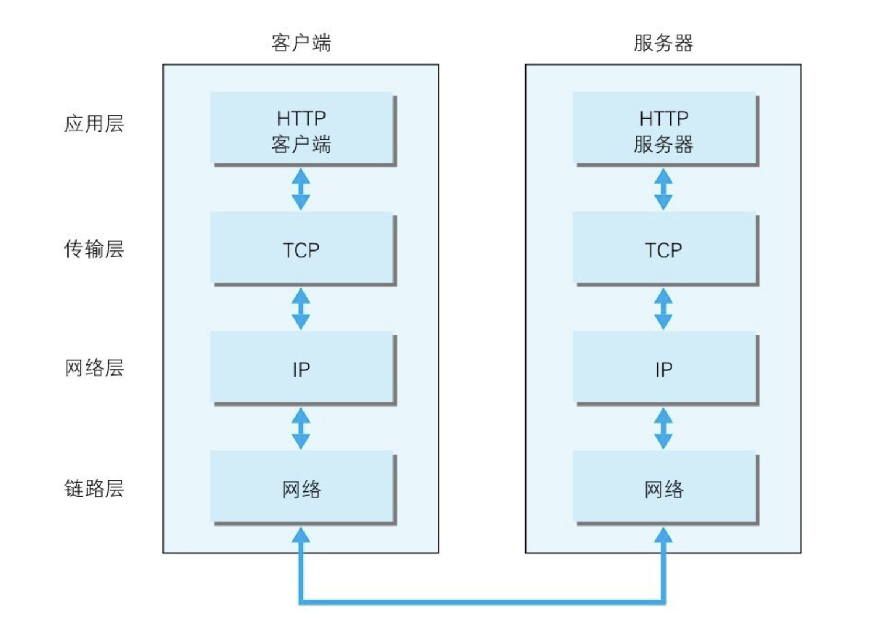

### 浏览器

> 多进程多线程的应用程序

**主要的进程**：

- 浏览器进程：主要负责页面展示，用户交互，管理子线程，会启动多个线程处理不同的任务
- 网络进程：负责加载网络资源
- 渲染进程：渲染进程启动后，会开启一个渲染主线程，负责 html，css，js 的执行

  默认情况下浏览器会为每个标签页开启一个新的渲染进程，保证页面之间不相互影响。

  **扩展**：

  - 进程：程序需要一个自己专属的内存空间，每一个应用至少有一个进程，进程之间相互独立，即使要通信也需要双方同意
  - 线程：运行代码，一个进程至少有一个线程，当程序开启后会自动运行一个线程来执行代码

  例如：

  #### 事件循环

  > 单线程是异步产生的原因，事件循环是异步的实现方式。事件循环又叫消息循环，是浏览器渲染主线程的一个工作方式。

  在浏览器源码中开启了一个永不结束的 for 循环，每次循环从消息队列中取出第一个任务执行，而其他的线程只需要在合适的时机加入到队列的末尾即可。过去将消息队列分成宏任务和微任务，这种说法目前已经无法满足浏览器复杂的环境。根据 w3c 官方解释，每个任务都有不同的类型，同类型的任务放在同一队列中，不同的任务队列又有不同的优先级，微队列有最高的优先级，其他队列由浏览器自行决定，例如：交互队列在延迟队列前（用户行为）

### 从输入 URL 到最终渲染，浏览器做了什么？

- DNS 解析 解析域名 获取 ip 地址
- 建立 TCP 连接 三次握手 四次挥手
- 发起 http 请求 服务器做出响应
- 客户端渲染

  TCP/IP 通信传输流
  

### 浏览器渲染原理

当浏览器的网络线程收到 html 后，会产生一个渲染任务，并将其传递给渲染线程的消息队列，在事件循环的作用下，渲染主线程取出任务，开启渲染流程。
整个流程分为多个阶段

html 解析 -> 样式计算 -> 布局 -> 分层 -> 绘制 -> 分块 -> 光栅化 -> 画

- html 解析：
  生成 Dom 树，cssom 树。
- 样式计算：
  遍历节点，得到一颗带有样式的 Dom 树，在这一个过程中，很多预设值会变成绝对值，相对单位变成绝对单位。
- 布局：
  依次遍历 Dom 树的每一个节点，计算每个节点的几何信息，例如：宽高、相对包含块的位置
- 分层：
  主线程会使用一套复杂的策略对整个布局树中进行分层（使用 will-change 属性可将元素设置为单独的一层）
- 绘制：
  主线程会为每个层单独产生指令集，用于描述这一层的内容该如何画出来，完成后将每个图层的信息提交给合成线程。
- 光栅化：
  合成线程会将块信息交给 GPU 进程，快速完成光栅化，结果就是一块一块的位图
- 画：
  合成线程拿到每个层，每个块的位图后，生成一个个指引信息，然后交给 GPU 线程，由 GPU 线程产生系统调用，完成最终的屏幕成像。

**总结**：开启渲染线程后，开始解析 html 生成 dom 树，cssom 树，然后进行样式计算，将生成的 cssom 树和 dom 树计算得到最终的一个样式，再依次遍历每个节点，计算出每个节点的几何信息，然后将页面分成几个图层，每个层面单独进行绘制（提高渲染效率）,然后产生绘制指令，讲指令交给合成线程进行分块后对每一个小块进行光栅化（像素点），最后交给 GPU 线程画出来。

**扩展**：我们通过了解上面的流程可以引伸出下列问题

- 什么是 reflow

  - reflow 的本质是重新计算 layout （一般是 width height padding margin 等改动造成）
  - 为了避免连续多次的操作导致布局树反复计算，浏览器会合并这些操作，当 js 执行完成后才统一计算，改动属性造成的回流是异步完成的。由于这个原因，当 js 获取获取布局属性时，了能会导致获取到的不是最新布局信息，浏览器在权衡利弊下，座钟决定获取属性会立即 reflow。（避免反复多次获取布局属性）

- 什么是 refaint
  - refaint 的本质是重新根据分层信息绘制指令（一般 可见样式变动会导致）
  - reflow 一定会导致 refaint

### 导致页面白屏的原因及解决

**原因**

- 在渲染页面的时候需要加载很大的 js 文件，在 js 未解析完成之前无法展示页面，或网络延迟，js 加载延迟。
- url 无效或有中文字符
- 缓存原因：在客户端会默认缓存 index.html 文件，但是由于 vue 打包生成的 css/js 都是哈希值，跟上次文件名不一样，因此会出现找不到文件的情况从而导致白屏

**解决**

- 路由懒加载
- cdn 资源优化
- 缓存（静态资源缓存）
- 使用骨架屏 loading 状态

### web 缓存

> web 缓存主要指的是两部分：浏览器缓存和 http 缓存

**浏览器缓存**

比如,localStorage,sessionStorage,cookie 等等。这些功能主要用于缓存一些必要的数据，比如用户信息。比如需要携带到后端的参数。亦或者是一些列表数据等等。

**http 缓存**

当客户端向服务器请求资源时，会先抵达浏览器缓存，如果浏览器有“要请求资源”的副本，就可以直接从浏览器缓存中提取而不是从原始服务器中提取这个资源。

- 强缓存
  - 浏览器不会向服务器发送请求，直接从本地缓存中读取文件。
- 协商缓存

  - 浏览器会向服务器发送请求，服务器会根据请求头的一些参数来判断是否命中协商缓存，如果命中，则返回 304 状态码并带上新的请求头通知浏览器从缓存中读取资源。

    如何判断是否命中：

    1. Etag/if-None-Match 字段，表示每个文件的标识，返回一个 hash 值，当浏览器第二次发起请求时，会在请求头中带上 if-None-Match,其值就是 Etag 的值。（更加准确，文件尺寸大，数量多，并且计算频繁，那么 ETag 的计算就会影响服务器的性能）
    2. Last-Modify/If-Modify-Since 这两个都表示资源最后的修改时间，浏览器第一次请求一个资源的时候，服务器返回的 header 中会加上 Last-Modify，浏览器再次请求服务器时，请求头中会包含 If-Modify-Since，值为缓存之前返回的 Last-Modify。（当文件在极短时间内完成修改的时候，可能修改时间不会改变，识别不到）

**总结**：http 缓存主要分为强缓存和协商缓存，当强缓存生效时不会向服务器发起请求，如果缓存时间过期或者用户强制刷新的话则会跳过强缓存进入协商缓存，协商缓存会跟服务器进行比对从而判断是否要使用缓存。


### web 常见的攻击方式有哪些？如何防御？

1. XSS 跨站脚本攻击、
   在 web 页面恶意插入 HTML 或 script 标签，当用户浏览该页面时，恶意代码就会被执行，从而达到攻击的目的

   **防御**：
   1、标签过滤。2、将 cookie 设置为 http-only,js 脚本将无法读取到 cookie 信息。3、纯前端渲染

2. CSRF 跨站点请求伪造
   通过伪造连接请求，在用户不知情的情况下，让用户以自己的身份来完成非本意操作的攻击方法

   **防御**：
   1、 Cookie 设置 SameSite 属性。该属性表示 Cookie 不随着跨域请求发送。2、检查 HTTP 中的 referer 字段。3、在请求头中加入 token 验证字段

3. 点击挟持
   利用 css 将攻击者实际想让你点击的页面隐藏，实际上点击的是 iframe 中嵌套的网页。

   **防御**： http 响应头 X-FRAME-OPTIONS 禁止嵌套

### SPA 首屏加载慢如何解决

- 动态懒加载所需插件
- 使用 CDN 资源；vue-ssr
- 减小入口文件积
- 静态资源本地缓存
- UI 框架按需加载
- 图片资源的压缩
- 组件重复打包
- 开启 GZip 压缩

### 实现响应式布局的几种方法

- 媒体查询
- flex 布局
- grid 布局
- 相对单位和百分比
- 一些 UI 组件自带的布局

### 垂直水平居中的几种方式

```
  <style>
      .parent {
        margin: auto;
        width: 500px;
        height: 500px;
        background: pink;
        /* 1、flex 布局 */
        /* display: flex;
        align-items: center;
        justify-content: center;
        或者父元素设置为flex 子元素设置 margin:auto
        */
        position: relative;
      }
      .son {
        width: 100px;
        height: 100px;
        background: rgb(24, 136, 44);
        position: absolute;
        /* 2、定位+ transform */
        /* top: 50%;
        left: 50%;
        transform: translate(-50%, -50%); */
        /* 3、定位+ margin auto */
        /* left: 0;
        right: 0;
        top: 0;
        bottom: 0;
        margin: auto; */
        /* 4、定位+ margin负边距 */
        /* top: 50%;
        left: 50%;
        margin-left: -50px;
        margin-top: -50px; */
      }
    </style>
```

### width:100%与 width:auto 区别

```
都是由最近父级决定，不过auto不会超出父级，100%的padding，border写多了容易超出父级，一般都是用auto，不写默认就是auto
width:auto;会包含padding,border,margin的宽度，width:100%;在content-box下是不会包含这三个的宽度的
```

### BFC 及其应用

```
BFC 就是块级格式上下文，是页面盒模型布局中的一种 CSS 渲染模式，相当于一个独立的容器，里面的元素和外部的元素相互不影响。创建 BFC 的方式有：
html 根元素
float 浮动
绝对定位
overflow 不为 visiable
display 为表格布局或者弹性布局

BFC原理
1.就是在BFC这个元素的垂直方面边距(margin)会发生重叠
2.BFC的区域不会与浮动元素的box重叠
3.BFC在页面中是一个独立的容器，外面的元素不会影响它里面的元素
4.计算BFC高度的时候，浮动元素也会参与计算

BFC 主要的作用是：
清除浮动
防止同一 BFC 容器中的相邻元素间的外边距重叠问题
```
