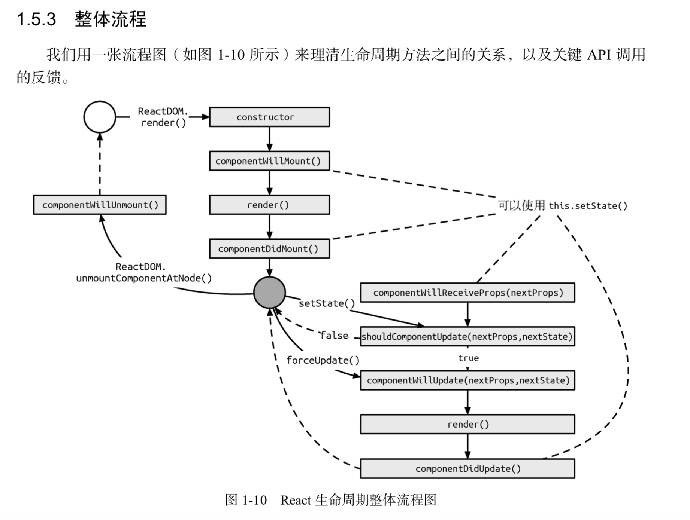

### react 中使用的 key 有什么作用，key 的内部原理是什么

```
key是虚拟dom的标识

当状态中的数据发生变化时，reaxt会根据 新的数据生成薪的虚拟dom，然后比较进行新旧虚拟dom的diff比较
比较规则：
旧虚拟都没中没有找到与新虚拟dom相同的key 根据数据创建新的真实dom渲染到页面上。
找到相同的key 若虚拟dom中内容没变，直接使用之前的真实dom，变了，则生成新的真实dom，替换掉页面中之前的真实dom。

用index作为key可能引发的问题：
a、若对数据进行：逆序添加，删除等破坏顺序的操作，会产生没必要的dom更新。
b、如果包含输入类型的dom 会产生错误dom更新。
```

### 生命周期

```
1、componentWillMount()
2、componentDidMount()
3、componentWillReceiveProps()
4、shouldComponentUpdate()
5、componentWillUpdate()
6、componentDidUpdate()
7、componentWillUnmount()
```



### 和 vue 的区别

- 相同点：

1. 数据驱动视图
2. 组件化
3. 都使用了虚拟 DOM

- 不同点

1. 写法不同：react 是 jsx+inline style，也就是把 html 和 css 写在 javaScript 中。vue 是 html+css，写在 html 中。
2. 响应式原理不同：vue 依赖收集，自动优化，数据可变，react 手动优化 数据不可变，需要 setState 驱动新的 state
3. diff 算法：vue 对比节点，当节点元素相同时，但是 class 不同，认为是不同类型的元素，但是 react 认为是同类型的元素，只是修改节点属性。
4. 框架：Vue 本质是 MVVM 框架，由 MVC 发展而来，React 是前端组件化框架，由后端组件化发展而来。

### react 异步渲染的概念，介绍 Time Slicing 和 Suspense

1. Time Slicing：时间片段，react 采用时间片段的方式，将渲染任务分成若干个时间片段，然后交给浏览器去执行，这样可以让浏览器有时间去渲染其他任务，从而提高渲染性能。
2. Suspense：suspense 是一个新的 React 特性，它可以让你在等待一个数据的时候显示一个占位符，而不是一直等待。

### pureComponent 和 FuctionComponent 区别

FunctionComponent 相比于 PureComponent，每次渲染都需要重新计算 props 和 state，而 PureComponent 则只会在 props 或 state 改变时才会重新渲染。
pureComponent 能够节省大部分不必要的渲染

### react 里面的 bind 和箭头函数

this 指向问题，普通函数中 this 关键字会随着执行上下文的变化而改变，尖头函数中 this 始终指向函数的执行上下文，而 bind 则是将函数的执行上下文固定在 bind 之后的对象上。

### useEffect 模拟生命周期

- 不传递第二个参数 相当于执行了 componentDidMount componentDidUpdate 这两个生命周期函数

```jsx
import React, { useState, useEffect } from 'react';
const Index = () => {
  // useEffect 实现生命周期
  const [count, setCount] = useState(0);
  useEffect(() => {
    console.log('didMount');
    document.title = count;
  }, []);
  return (
    <div>
      home
      <button
        onClick={() => {
          setCount(count + 1);
        }}
      >
        {count}
      </button>
    </div>
  );
};

export default Index;
```

- 传递 [] 相当于只触发了 componentDidMount

```jsx
import React, { useEffect, useState } from 'react';
const Index = () => {
  const [count, setCount] = useState(0);
  useEffect(() => {
    console.log('didMount');
  }, []);
  return (
    <div>
      <button
        onClick={() => {
          setCount(count + 1);
        }}
      >
        {count}
      </button>
    </div>
  );
};
export default Index;
```

- 加上 return 语句 相当于触发了 componentDidMount 和 componentWillUnmount

```jsx
import React, { useEffect, useState } from 'react';
const Index = () => {
  const [count, setCount] = useState(0);
  /* componentWillUnmount */
  useEffect(() => {
    console.log('mount');
    return () => {
      console.log('离开当前页面');
    };
  }, []);
  return (
    <div>
      <button
        onClick={() => {
          setCount(count + 1);
        }}
      >
        {count}
      </button>
    </div>
  );
};
export default Index;
```

- 监听某个值的变化 只有值变化才会执行

```jsx
import React, { useState, useEffect } from 'react';
const Index = () => {
  const [count, setCount] = useState(0);
  useEffect(() => {
    return () => {
      console.log(count);
      document.title = count;
    };
  }, [count]);
  return (
    <div>
      home
      <button
        onClick={() => {
          setCount(count + 1);
        }}
      >
        {count}
      </button>
    </div>
  );
};

export default Index;
```

- 模拟生命周期

```jsx
import React, { useEffect, useState } from 'react';
const Index = () => {
  const [count, setCount] = useState(0);
  /* 1、componentDidMount */
  useEffect(() => {
    console.log('组件被创建');
  }, []);
  /* 2、componentDidMount--componentDidUpate */
  useEffect(() => {
    console.log('数据更新了');
  }, [count]);
  /* 3、componentWillUnmount */
  useEffect(() => {
    return () => {
      console.log('组件被销毁了');
    };
  }, []);
  return (
    <div>
      <button
        onClick={() => {
          setCount(count + 1);
        }}
      >
        {count}
      </button>
    </div>
  );
};
export default Index;
```

### react 组件中的通信

- 父传子 使用 props useContext

```jsx
// useContext传递的数据，在Context.Provider的所有子组件中都可以获取到，value一旦更新，所有子组件也会同步更新
// 父组件代码
import React from 'react';
import ChildB from './ChildB';

export const Context = React.createContext < String > '';

function App() {
  return (
    <Context.Provider value={'context传值'}>
      <div>
        <ChildB></ChildB>
      </div>
    </Context.Provider>
  );
}

export default App;

// 子组件代码
import { useContext } from "react"
import { Context } from "./App"

const ChildB = () => {

    const title = useContext(Context)

    return <div>
        这是ChildB {title}
    </div>
}

export default ChildB

```

- 子传父
  1. props 回调函数

```jsx


// 子组件
interface ChildAProps {
    title?: string
    call?: (param: string) => void
}
const ChildA: React.FC<ChildAProps> = ({title, call}) => {
    return <div onClick={()=>{
        call && call('回传参数')
    }}>这是ChildA {title}</div>
}

export default ChildA

// 父组件
import React from 'react';
import ChildA from './ChildA';

function App() {
  return (
      <div>
       <ChildA call={(v)=>{
         console.log(`子组件传过来的值 ${v}`)
       }}></ChildA>
      </div>
  )
}

export default App

```

2. useRef 函数调用 ref 的方式可以为父组件提供一个可以调用子组件的函数，在子组件被调用的函数中可以返回相应的数据至父组件，父组件则需要在子组件的 Props 中传入一个 ref

```jsx


// 子组件
import { MutableRefObject, useImperativeHandle } from 'react';

export interface ChildDCurrent {
  refresh: () => string;
}

interface ChildDProps {
  cref: MutableRefObject<ChildDCurrent>;
}

const ChildD: React.FC<ChildDProps> = ({ cref }) => {
  useImperativeHandle(cref, () => ({
    refresh: () => {
      return '123';
    },
  }));

  return <div></div>;
};

export default ChildD;

// 父组件

import { MutableRefObject, useRef } from "react"
import ChildD, { ChildDCurrent } from "./ChildD"

const ChildC = () => {

    const ref = useRef() as MutableRefObject<ChildDCurrent>

    return <div>
        <button onClick={()=> {
            // ChildD传过来的数据
            const title = ref.current.refresh()
            console.log(`子组件传递过来的数据 ${title}`)
        }}>
            点击刷新
        </button>
        <ChildD cref={ref}></ChildD>
    </div>
}

export default ChildC

```

- 兄弟组件之间的通信 可以利用组件的 Props 以及 Props 回调函数来进行，而这种使用方法通信的前提是：必须要有共同的父组件

```jsx

// 子组件
interface ChildFProps {
    update: (title: string) => void
}
const ChildF: React.FC<ChildFProps> = ({update}) => {
    return <div onClick={() => {
        update('abcde')
    }}>ChildF</div>
}
export default ChildF


interface ChildGProps {
    title: string
}
const ChildG: React.FC<ChildGProps> = ({title}) => {
    return <div>ChildG {title}</div>
}
export default ChildG

//父组件
import { useState } from "react"
import ChildF from "./ChildF"
import ChildG from "./ChildG"

const ComE = () => {
    const [updateValue, setUpdateValue] = useState('')
    return <div>
        <ChildF update={(v) => {
            setUpdateValue(v)
        }}></ChildF>
        <ChildG title={updateValue}></ChildG>
    </div>
}
export default ComE


```

- 任意组件之间的通信
  > 使用 eventBus

```jsx
// 接受数据组件
import { useEffect, useState } from "react"
import event from "./class/event"

const ChildI = () => {
    const [message, setMessage] = useState('')
    useEffect(() => {
        //监听消息
        event.addListener('message', (message) => {
            setMessage(message)
        })
        return () => {
            event.removeListener('message', (message) => {
                console.log(message)
            })
        }
    })

    return <div>{message}</div>
}

export default ChildI

//发送数据的组件代码
import event from "./class/event"

const  ChildJ = () => {
    return <div>
        <button onClick={() => {
            //发送消息
            event.emit('message','这是我发的消息')
        }}>发送消息</button>
    </div>
}

export default ChildJ
```

### hooks 使用规则

- 只能在函数外层调用 Hook，不要在循环、条件判断或者子函数中调用
- 只能在 React 的函数组件和自定义 Hook 中调用 Hook。不要在其他 JavaScript 函数中调用

- 为什么

1. 不要在普通的 JavaScript 函数中调用 Hook 的原因是在其他函数中使用的 hooks 函数实际上都是名为 throwInvalidHookError 的函数。
2. 不要在循环，条件或嵌套函数中调用 Hook 的原因是如果 hooks 的执行顺序发生变化会导致 hooks 中使用错误的 hook 对象。

### react 组件的概念（高阶组件，受控组件，非受控组件）

- 高阶组件：高阶组件是参数为组件，返回值为新组件的函数
- 受控组件：受控组件是指组件的 state 由父组件来维护，通过 props 向子组件传递数据，通过 onChange 事件来更新 state 表单元素（如<input>、 <textarea> 和 <select>）
- 非受控组件：非受控组件更像是传统的 HTML 表单元素，数据存储在 DOM 中，而不是组件内部，获取数据的方式是通过 ref 引用

### 类组件和函数组件的区别

1. 语法和写法：类组件是使用类的语法进行定义的，它继承自 React.Component 类，并且需要实现 render() 方法来返回组件的 JSX。函数组件是使用函数的语法进行定义的，它接收一个 props 对象作为参数，并返回组件的 JSX
2. 状态管理：在类组件中，可以使用 state 属性来存储和管理组件的内部状态。state 是一个可变的对象，当状态发生变化时，组件会重新渲染。函数组件使用 useState Hook 来管理组件的状态
3. 生命周期：类组件的生命周期方法包括：componentDidMount()、componentDidUpdate()、componentWillUnmount()，函数组件的生命周期方法包括：useState()、useEffect()、useContext()。

### react 页面跳转路由传参方法

- params 传参
  优点：刷新页面，参数不丢失
  缺点：1.只能传字符串，传值过多 url 会变得很长 2. 参数必须在路由上配置

  ```jsx
  //路由配置
  { path: '/detail/:id/:name', component: Detail },
  import { useHistory,useParams } from 'react-router-dom';
  const history = useHistory();
  // 跳转路由   地址栏：/detail/2/zora
  history.push('/detail/2/zora')
  // 获取路由参数
  const params = useParams()
  console.log(params) // {id: "2",name:"zora"}

  ```

- search 传参
  优点：刷新页面，参数不丢失
  缺点：只能传字符串，传值过多 url 会变得很长，获取参数需要自定义 hooks

  ```jsx
  //路由配置
  { path: '/detail', component: Detail },
   import { useHistory } from 'react-router-dom';
  const history = useHistory();
  // 路由跳转  地址栏：/detail?id=2
  history.push('/detail?id=2')
  // 或者
  history.push({pathname:'/detail',search:'?id=2'})

  /**
  * 自定义hooks用于获取路由参数
  * IE11及以下浏览器 不支持浏览器内置的URLSearchParams API
  **/
  function useQuery() {
    return new URLSearchParams(useLocation().search);
  }
  const query = useQuery()
  const id = query.get('id') //2

  /**s
      自定义hooks
  */
  import { useLocation } from 'react-router-dom';
  import qs from 'query-string';

  export function useQuery<T = any>(): T {
    const { search } = useLocation();
    return (qs.parse(search) as unknown) as T;
  }
  const query = useQuery<IRouteQuery>();
  const {id} = query

  ```

- 3. state 传参
     优点：可以传对象
     缺点： <HashRouter>刷新页面，参数丢失
  ```jsx
  //路由配置
  { path: '/detail', component: Detail },
  import { useHistory,useLocation } from 'react-router-dom';
  const history = useHistory();
  const item = {id:1,name:"zora"}
  // 路由跳转
  history.push(`/user/role/detail`, { id: item });
  // 参数获取
  const {state} = useLocation()
  console.log(state) // {id:1,name:"zora"}
  ```
  **提示：**<HashRouter> 不支持 location.key 与 location.state，<HashRouter>通过 state 传递参数，刷新页面后参数丢失，官方建议使用<BrowserRouter>，<BrowserRouter>页面刷新参数也不会丢失

### hooks 使用

- 在 if 中报错  
  会破坏它们的执行顺序和依赖性，可能导致状态不一致和渲染问题
  因为 react 函数式组件每次渲染都会重新生成状态，且每次渲染都有一个状态序列，如果在 if 中调用，可能导致某次渲染时状态序列的缺失
- 为什么 react 函数式组件 每次渲染都有一个状态序列
  因为在使用 useState 声明时，只赋给了变量初始值，并没有给状态加 key
- 在循环中不能使用
  循环中也是条件语句
- 那在 vue3 中为什么不存在这个问题
  因为 vue3 的渲染函数只执行一次，在组件初次渲染的时候，会执行一次 setup 函数并创建响应式对象（返回的是一个函数），然后使用闭包进行缓存，后续组件会直接使用缓存的渲染函数
  react 返回的是一个视图，本质上是一个对象

  **自定义 hooks**
  自定义 Hook，实际上就是把很多重复的逻辑都放在一个函数里面，通过闭包的方式给 return 出来
  **介绍自定义 hooks**
  useProject: 表格中有一列被多处使用，抽出后导出它的列配置，组合好的 props，search 回调
  useDict: 获取字典数据，用于转换对象为字典格式

### Context API 使用方法如下：

看成扩大版的 props，将全局的数据通过 provider 接口传递 value 给局部的组件,局部组件从 value 接口中传递的数据对象中获取读写接口

- 创建 Context 对象
  可以使用 React.createContext()方法创建一个 Context 对象，该方法返回一个包含 Provider 和 Consumer 组件的对象。Provider 组件用于提供数据，Consumer 组件用于消费数据。

- 使用 Context 对象
  我们可以在需要使用数据的组件中，使用 Consumer 组件来获取外层 Context 数提供的数据。Consumer 组件需要传入一个函数，该函数接收 Provider 组件提供的数据作为参数，并返回需要渲染的内容。
  对于函数组件来说，还可以使用 useContext()钩子来获取 Provider 组件提供的数据，该钩子接收一个 Context 对象作为参数，并返回 Provider 组件提供的数据。

### useMemo 和 useCallback 的区别

- useMemo：用于缓存计算结果，避免重复计算。
- useCallback：用于缓存函数，避免重复创建函数。适用于需要传递给子组件的事件处理函数
  react.memo ：用于缓存组件，避免重复渲染。

### redux 使用

react-redux：将状态放在 store 中，组件可以通过 dispatch 触发 action，action 通过 reducer 更新 state，state 更新后，store 会通知所有订阅者，组件重新渲染。
单一数据源，state 是只读的，唯一改变的方法是通过触发 action。
适用场景：1.应用状态频繁变化，需要实时更新。2.更新该状态的逻辑很复杂，中大型代码量的应用，很多人协同开发

connect 作用：1、获取 state 2、监听 store tree 的变化 3、将组件与 store 进行关联，将 store 的 state 映射到组件的 props 中，将组件的 props 映射到 store 的 dispatch 中，从而实现组件与 store 的双向绑定。

### reacct 18 新特性

1. 做了一些性能优化，批处理支持的范围变大，Promise，setTimeout，native event handlers 等这些非 React 原生的事件内部的更新也会得到合并
2. 新增一些 hooks，useTransition（用于区分高优更新和非高优更新的新概念）、useId（用于解决 SSR 时客户端与服务端难以生成统一的 ID 的问题）

### react-router

1. hash：HashRouter
   hash 值改变，触发全局 window 对象上的 hashchange 事件。所以 hash 模式路由就是利用 hashchange 事件监听 URL 的变化，从而进行 DOM 操作来模拟页面跳转
2. history: BrowserRouter

### 组件

纯函数组件：无状态，无生命周期
受控组件：一个表单元素的值由组件的状态控制，而不是 Dom 元素自身控制
高阶组件：接受一个组件为参数的函数，返回一个新的组件，用于增强或者修改组件的行为。

### hooks 优点
