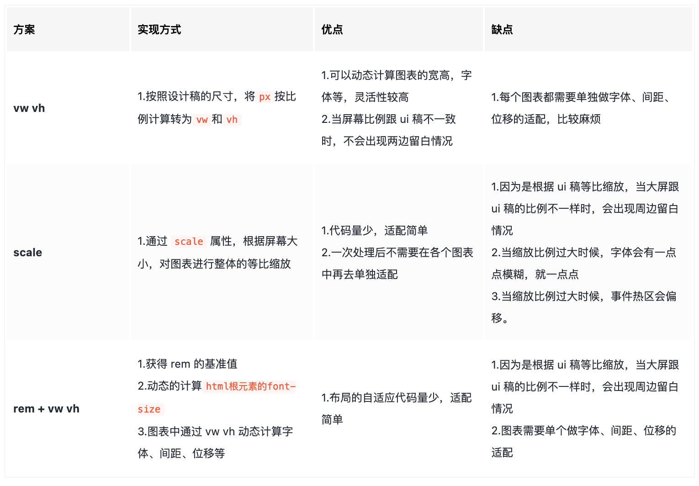

### 设计模式

- 单例模式：就是保证一个类只有一个实例，实现的方法一般是先判断实例存在与否，如果存在直接返回，如果不存在就创建了再返回，这就确保了一个类只有一个实例对象。在 JavaScript 里，单例作为一个命名空间提供者，从全局命名空间里提供一个唯一的访问点来访问该对象。
- 策略模式：策略模式定义了一系列算法，并将每个算法封装起来，使它们可以相互替换，且算法的变化不会影响使用算法的客户。
- 观察者模式: 观察者的使用场合就是：当一个对象的改变需要同时改变其它对象，并且它不知道具体有多少对象需要改变的时候，就应该考虑使用观察者模式。
- 工厂模式解决了重复实例化的问题，缺点，创建不同对象其中属性和方法都会重复建立，消耗内存；还有函数识别问题等等。

例子：

### diff 算法原理

> 用于比较两个虚拟 DOM 树之间的差异，并更新实际的 DOM 结构，以提高性能和效率

Diff 算法的关键在于遍历虚拟 DOM 树并比较节点的差异。

1. 对比两个节点的属性
2. 对比两个节点的字节点
3. 对比两个节点的 key

### websocket 通信原理

> WebSocket 是基于 TCP 的一种新的应用层网络协议。它实现了浏览器与服务器全双工通信，即允许服务器主动发送信息给客户端

WebSocket 的原理就是通过 HTTP 协议建立一个长连接，在这个连接上可以进行双向通信，从而实现实时通信和推送

- 常见问题：

Q：WebSocket 能全双工，为何普通 HTTP 请求不行？（他们建立在 TCP 协议之上的，TCP 协议本就实现了全双工通信）

A：其实是 HTTP 的“请求－应答模式”限制了 TCP 协议本支持的全双工通信。

Q：WebSocket 和 Socket 的区别

A：Socket 不是协议，是应用层与 TCP/IP 通信的中间软件抽象层，是一组接口。而 WebSocket 是应用层协议。

Q：WebSocket 长连接和 HTTP 长连接的区别

A：HTTP/1.1 默认开启了长连接（Connection:keep-alive），本质是 TCP 长连接，可在一次 TCP 连接中完成多个 HTTP 请求。

WebSocket 的长连接是真正的全双工，TCP 链路建立后，双方可以互发消息，无需再设置请求头，且双方都需要维持住这个连接。

- 建立过程
  1. 浏览器发起一个 http 请求建立连接 ，请求地址以 ws://开头，请求头 Upgrade: websocket 和 Connection: Upgrade 表示这个连接将要被转换为 WebSocket 连接。
  2. 服务器响应请求 响应头 HTTP/1.1 101 Switching Protocols 和 Upgrade: websocket 表示本次连接的 HTTP 协议即将被更改（代码 101），改为指定的 WebSocket 协议

### websocket 的心跳检测和断线重连

### 工具，公共组件，自定义的 hooks

1. 工具函数

2. 公共组件
   下拉选择 searchSelect
   快速查看 quickview
   pdf 阅读
   审批流
   图片预览
   表单表格（vue）

3. 自定义的 hooks
   字典解析：useDict 表格单项提取：useTableItem
   自定义 Hook 更适合于抽象状态逻辑和功能，以便在多个组件间共享和复用。
   组件 更侧重于 UI 的结构和视图表现，它们是构建用户界面的基础

### 哪些 hooks 比较常用

useEffect ：用于处理副作用，如数据请求、DOM 操作等。
useState ：用于管理组件的状态，可以更新和读取状态。
useRef ：用于获取 DOM 元素或组件的引用，可以避免在每次渲染时重新创建引用。
useMemo ：用于缓存计算结果，避免重复计算。
useCallback ：用于缓存函数，避免在每次渲染时重新创建函数。
useImperativeHandle：用于自定义暴露给父组件的实例值或方法。

### 写过哪些 hooks

### 大屏适配



1. 将 px 转换为 vw vh 实现

```js
// 使用 scss 的 math 函数，https://sass-lang.com/documentation/breaking-changes/slash-div
 @use "sass:math";

// 默认设计稿的宽度
$designWidth: 1920;
// 默认设计稿的高度
$designHeight: 1080;

// px 转为 vw 的函数
@function vw($px) {
  @return math.div($px, $designWidth) \* 100vw;
}

// px 转为 vh 的函数
@function vh($px) {
  @return math.div($px, $designHeight) \* 100vh;
}
```

2. scare 实现

```js
<div className="screen-wrapper">
    <div className="screen" id="screen">

    </div>
 </div>

   handleScreenAuto() {
   const designDraftWidth = 1920; //设计稿的宽度
   const designDraftHeight = 960; //设计稿的高度
   // 根据屏幕的变化适配的比例
   const scale =
   document.documentElement.clientWidth /
   document.documentElement.clientHeight <
   designDraftWidth / designDraftHeight
   ? document.documentElement.clientWidth / designDraftWidth
   : document.documentElement.clientHeight / designDraftHeight;
   // 缩放比例
   document.querySelector(
   '#screen',
   ).style.transform = `scale(${scale}) translate(-50%, -50%)`;
   },


   .screen-root {
    height: 100%;
    width: 100%;
    .screen {
        display: inline-block;
        width: 1920px;  //设计稿的宽度
        height: 960px;  //设计稿的高度
        transform-origin: 0 0;
        position: absolute;
        left: 50%;
        top: 50%;
    }
}
```

3. rem+vw+vh

```js
.postcssrc.js配置文件
module.exports = {
  plugins: {
    autoprefixer: {},
    '@njleonzhang/postcss-px-to-rem': {
      unitToConvert: 'px', // (String) 要转换的单位，默认是 px。
      widthOfDesignLayout: 1920, // (Number) 设计布局的宽度。对于pc仪表盘，一般是 1920.
      unitPrecision: 3, // (Number) 允许 rem 单位增长到的十进制数字.
      selectorBlackList: ['.ignore', '.hairlines'], // (Array) 要忽略并保留为 px 的选择器.
      minPixelValue: 1, // (Number) 设置要替换的最小像素值.
      mediaQuery: false, // (Boolean) 允许在媒体查询中转换 px.
    },
  },
};

```

### unocss 原子化

UnoCSS 是一个即时的原子化 CSS 引擎，旨在灵活和可扩展

### umi 优势

是一个插件式的前端应用框架，通过提供插件和插件集的机制来满足不同场景和业务的需求，它的插件体系涵盖了从源码构建到产物的每个生命周期。可扩展性强。
具体实践：数据流、请求、权限、国际化、微前端、icons 使用、编辑器使用
分为构建时配置和运行时，提供插件（整个生命周期，编译前后，给一些东西实现自己逻辑）
运行时：交给浏览器运行的代码。路由，UI，业务代码，hooks
构建层：底层 api,配置打包的产物，alias，css 加载器（构建工具的配置）

### Restful 接口规范

### 运行时

node：是 js 运行时环境，commonjs 是 js 的规范，node 中，commanjs 规范呗广泛使用
node 运行时环境支持：通过事件循环和回调函数处理并发，可以在 windows、linux、macOS 多个平台上运行，拥有庞大的第三方库和工具集合。

构建工具：基于 node 封装。
vite：热部署更新主要是通过长链接实现
1、服务器启动时创建模块依赖图
2、使用文件系统监听项目文件变化，当检测到文件修改时，标记出受影响的模块
3、通过 websocket 发送更新，服务器通过 websocket 将模块更新信息发送给客户端
4、浏览器接收到信息后，，执行脚本进行更新操作

### slidev

基于 Web 的幻灯片制作工具。它帮助您以 Markdown 的形式专注于编写幻灯片的内容，并制作出具有交互式演示功能的、高度可自定义的幻灯片。
npm init slidev@latest

### 如何做大文件上传功能
