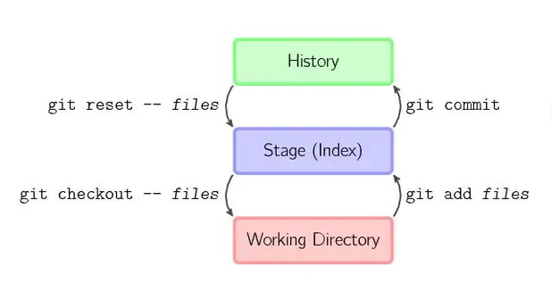

### 说说 git 发生冲突的场景？如何解决

**场景**：

1. 同时修改同一文件的冲突
2. 分支合并时的冲突
3. 合并远程分支时的冲突
4. 多人同时修改不同文件的冲突

**解决**：

- Pull 最新代码
- 合并冲突 ：手动解决
- 提交修改

### fork 仓库与上游保持更新

- 查看当前的远程仓库地址
  git remote -v
- 添加一个别名为 upstream（上游）的地址，指向之前 fork 的原仓库地址
  git remote add upstream https://github.com/xxx/xxx.git
- 抓取 upstream
  git fetch upstream
- 将上游同步到你想更新的分支
  git checkout main
  git merge upstream/main
- 接着就是熟悉的推送本地仓库到远程仓库
  git push origin main

### 版本回退

- git log --查看日志信息--通过注释看版本号,通过版本号实现回退功能
- git reset --hard/soft/mixed xxx 日志号

#### reset 三种模式区别和使用场景

**区别：**
--hard：重置位置的同时，清空暂存区和工作区。
--soft：重置位置的同时，所以效果看起来就是工作目录的内容不变，暂存区原有的内容也不变，只是原节点和 Reset 节点之间的所有差异都会放到暂存区中。
--mixed（默认）：所以效果看起来就是原节点和 Reset 节点之间的所有差异都会放到工作目录中。

**使用场景**
--hard： 要放弃目前本地的所有改变時，即去掉所有 add 到暂存区的文件和工作区的文件，可以执行 git reset -hard HEAD 来强制恢复 git 管理的文件夹的內容及状态

--soft：假如我们想合并「当前节点」与「reset 目标节点」之间不具太大意义的 commit 记录，可以使用--soft 合并 commit 节点。

--mixed（默认）：移除所有 Index 暂存区中准备要提交的文件、commit 提交某些错误代码，或者没有必要的文件也被 commit 上去，不想再修改错误再 commit（因为会留下一个错误 commit 点）

#### git 简单的分为三个区域 ：

● 1、工作区（working directory）
● 2、暂缓区（stage index）
● 3、历史记录区（history）


### 分支管理

- 在 master 分支合并其他分支

```
git checkout master
git merge 01login
git push
git push origin HEAD --force
```

- 删除分支：git branch -d 分支名

- 拉取远程指定分支到本地

```
git fetch origin dev（dev即分支名）

git checkout -b LocalDev origin/dev (LocalDev 为本地分支名，dev为远程分支名)

git pull origin dev（dev为远程分支名）
```
