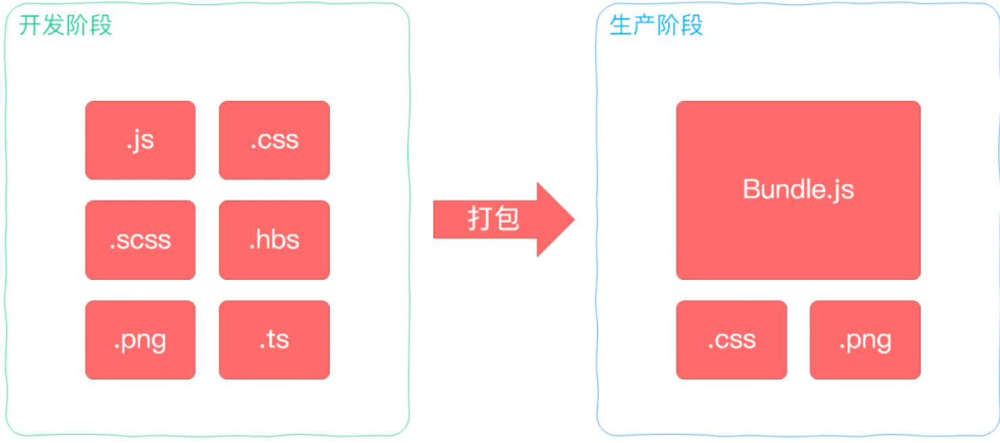

### 说说对 webpack 的理解

> webpack 是一个用于 javascript 应该程序的静态模块打包工具，有资源处理，模块整合的能力。

- 在编码上：对资源进行处理，比如压缩图片，将 scss 转成 css，将 ES6 语法转成 ES5 语法，将 TypeScript 转成 JavaScript 等等操作，提高效率，解决浏览器兼容问题。
- 模块整合能力，将 js，css，图片等打包成 bundle.js 文件，提高性能和可维护性，解决浏览器频繁请求文件的问题。
- 支持不同种类的前端模块类型，统一的模块化方案，所有资源文件的加载都可以通过代码控制

**webpack 常用配置**

1. entry：入口文件
2. output：输出文件
3. module：模块配置
4. plugins：插件配置
5. resolve：解析配置
6. devServer：开发服务器配置
7. optimization：优化配置
8. devtool：开发工具配置
9. mode：模式配置

**怎么编译的**

1. 读取配置文件
2. 解析入口：根据配置的入口，解析入口文件，生成依赖图谱，并生成模块对象
3. 确定模块依赖：根据入口文件，找出该模块依赖的模块，递归下去，直到所有入口依赖的模块都找出来。
4. 确定输出：根据入口和依赖关系，生成输出文件，输出文件名、路径、内容等。

**原理**

1. 初始化参数：解析 webpack 配置参数，合并 shell 传入和 webpack.config.js 文件配置的参数，形成最后的配置结果。
2. 开始编译：上一步得到的参数初始化 compiler 对象，注册所有配置的插件，插件监听 webpack 构建生命周期的事件节点，做出相应的反应，执行对象的 run 方法开始执行编译。
3. 确定入口：从配置的 entry 入口，开始解析文件构建 AST 语法树，找出依赖，递归下去。
4. 编译模块：递归中根据文件类型和 loader 配置，调用所有配置的 loader 对文件进行转换，再找出该模块依赖的模块，再递归本步骤直到所有入口依赖的文件都经过了本步骤的处理。
5. 完成模块编译：在经过第 4 步使⽤ Loader 翻译完所有模块后，得到了每个模块被翻译后的最终内容以及它们之间的依赖关系；
6. 输出资源：根据⼊⼝和模块之间的依赖关系，组装成⼀个个包含多个模块的 Chunk，再把每个 Chunk 转换成⼀个单独的⽂件加⼊到输出列表，这步是可以修改输出内容的最后机会；
7. 输出完成：在确定好输出内容后，根据配置确定输出的路径和⽂件名，把⽂件内容写⼊到⽂件系统。

- webpack 用过哪些 loader
  css-loader、style-loader、babel-loader、eslint-loader、stylelint-loader、sass-loader、less-loader、postcss-loader

- webpack 如何压缩代码， 打包用过什么插件
  Webpack 通过 TerserWebpackPlugin 移除 Javascript 代码中的不必要的字符和语句、丑化代码变量等从而减小代码的体积。
  HtmlWebpackPlugin css-minimizer-webpack-plugin terser-webpack-plugin

- vue 打包过大，如何使用 webpack 来进行优化。

1. 路由懒加载
2. 服务器和 webpack 同时配置 gzip
3. 优化打包 chunk-vendor.js 文件体积过大（拆分 js）

### webpack vite rollup

#### webpack vite rollup 适用场景

rollup 更适合打包库 （不支持热更新）
webpack 更适合打包项目（打包速度慢）
vite 基于 rollup 实现了热更新也适合打包项目（生态不及 webpack，加载器、插件不够丰富）

#### webpack code spliting 目的是什么？怎么实现的？

- Code Splitting 是 webpack 的一个重要特性，他允许你将代码打包生成多个 bundle。
- 对多页应用来说，它是必须的，因为必须要配置多个入口生成多个 bundle；
- 对于单页应用来说，如果只打包成一个 bundle 可能体积很大，导致无法利用浏览器并行下载的能力，且白屏时间长，Code Splitting 能够将代码分割，实现按需加载或并行加载多个 bundle，可利用并发下载能力，减少首次访问白屏时间，可以只上线必要的文件。

**实现**：

1. 多 entry 方式 指定多个打包入口
2. 公共提取 将公共模块提取出来生成一个 bundle
3. 动态加载

#### vite 为什么比 webpack 更快

**Vite 有如下特点**：

1. 快速的冷启动: No Bundle + esbuild 预构建
2. 即时的模块热更新: 基于 ESM 的 HMR，同时利用浏览器缓存策略提升速度
3. 真正的按需加载: 利用浏览器 ESM 支持，实现真正的按需加载

Vite 其核心原理是利用浏览器现在已经支持 ES6 的 import,碰见 import 就会发送一个 HTTP 请求去加载文件。Vite 启动一个 connect 服务器拦截这些请求，并在后端进行相应的处理将项目中使用的文件通过简单的分解与整合，然后再以 ESM 格式返回返回给浏览器。整个过程中没有对文件进行打包编译。

### 如何选择合适的打包工具，Webpack 和 Vite 的特点和使用场景。

- 构建理念不同

**Vite**：依赖预构建，开发期间启动一个服务器，index.html 作为入口文件，所以 index.html 中需要有  ；index.html 为源码和模块图的一部分。

**webpack**：会在内部构建依赖图。webpack 会默认将 ./src/index.js 作为构建的开始；进入入口后，webpack 找出有哪些模块和库是入口起点（直接和间接）依赖的。

**Vite**

1. 非打包构建，不必打包所有内容
2. 基于路由的代码拆分知道代码需要实际加载哪些部分，浏览器请求源文件时，再进行转换
3. 开发构建：分为依赖和源码
4. 依赖是第三方依赖，从 node_modules 文件夹中导入的 JavaScript 模块，使用 esbuild 处理
5. 源码即是业务源代码
6. 现代浏览器中的原生 ES 模块支持，浏览器在开发中承担打包工作

**webpack**

1. 识别入口文件
2. 逐级递归识别依赖，构建依赖图谱
3. 分析代码、转换代码、编译代码、输出代码
4. 输出打包后的代码

### 打包工具代码优化技巧

代码分割、懒加载、Tree Shaking

### 说说 gulp 和 webpack 的区别

> Webpack 是一个模块打包器（module bundler），而 Gulp 是一个任务执行器

- gulp 是工具链、构建工具，可以配合各种插件做 js 压缩，css 压缩，less 编译 替代手工实现自动化工作

1. 构建工具
2. 自动化
3. 提高效率用

- webpack 是文件打包工具，可以把项目的各种 js 文、css 文件等打包合并成一个或多个文件，主要用于模块化方案，预编译模块的方案

1. 打包工具
2. 模块化
3. 编译模块代码方案

### vite 原理

1. 是什么 基于 esbuild rollup。依靠浏览器自身 esm 编译功能的构建工具
2. 浏览器执行 esm 的 import 时，会像服务器发起该模块的请求。vite 中 hmr 是在原生的 esm 上执行，当编辑一个文件的时，vite 只需要精确的让已编译的模块失活。快速更新
3. 使用 http 缓存
