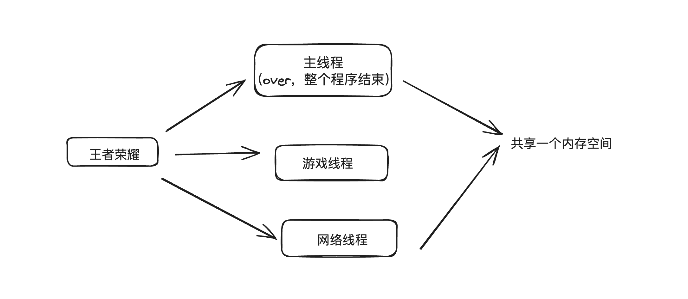
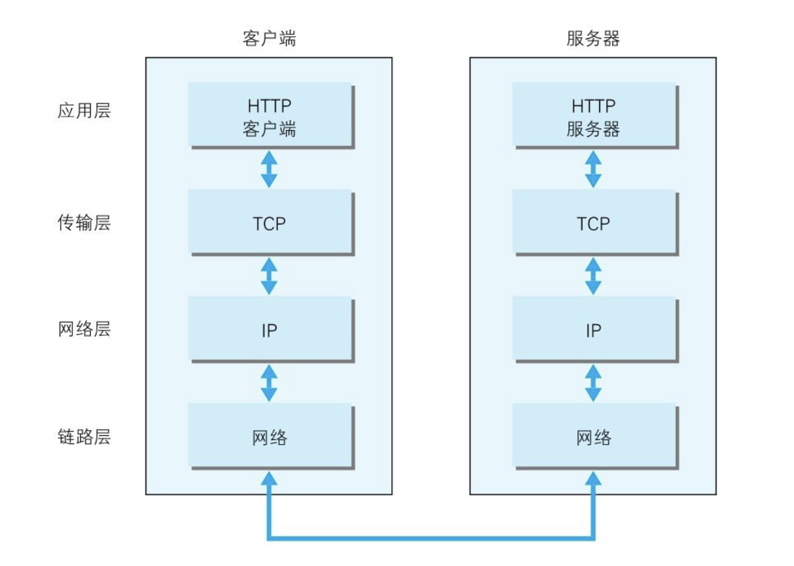

### 浏览器

> 多进程多线程的应用程序

**主要的进程**：

- 浏览器进程：主要负责页面展示，用户交互，管理子线程，会启动多个线程处理不同的任务
- 网络进程：负责加载网络资源
- 渲染进程：渲染进程启动后，会开启一个渲染主线程，负责 html，css，js 的执行

  默认情况下浏览器会为每个标签页开启一个新的渲染进程，保证页面之间不相互影响。

  **扩展**：

  - 进程：程序需要一个自己专属的内存空间，每一个应用至少有一个进程，进程之间相互独立，即使要通信也需要双方同意
  - 线程：运行代码，一个进程至少有一个线程，当程序开启后会自动运行一个线程来执行代码

  例如：

  #### 事件循环

  > 单线程是异步产生的原因，事件循环是异步的实现方式。事件循环又叫消息循环，是浏览器渲染主线程的一个工作方式。

  在浏览器源码中开启了一个永不结束的 for 循环，每次循环从消息队列中取出第一个任务执行，而其他的线程只需要在合适的时机加入到队列的末尾即可。过去将消息队列分成宏任务和微任务，这种说法目前已经无法满足浏览器复杂的环境。根据 w3c 官方解释，每个任务都有不同的类型，同类型的任务放在同一队列中，不同的任务队列又有不同的优先级，微队列有最高的优先级，其他队列由浏览器自行决定，例如：交互队列在延迟队列前（用户行为）

### 从输入 URL 到最终渲染，浏览器做了什么？

- DNS 解析 解析域名 获取 ip 地址
- 建立 TCP 连接 三次握手 四次挥手
- 发起 http 请求 服务器做出响应
- 客户端渲染

  TCP/IP 通信传输流
  

### web 缓存

> web 缓存主要指的是两部分：浏览器缓存和 http 缓存

**浏览器缓存**

比如,localStorage,sessionStorage,cookie 等等。这些功能主要用于缓存一些必要的数据，比如用户信息。比如需要携带到后端的参数。亦或者是一些列表数据等等。

**http 缓存**

当客户端向服务器请求资源时，会先抵达浏览器缓存，如果浏览器有“要请求资源”的副本，就可以直接从浏览器缓存中提取而不是从原始服务器中提取这个资源。

- 强缓存
  - 浏览器不会向服务器发送请求，直接从本地缓存中读取文件。
- 协商缓存

  - 浏览器会向服务器发送请求，服务器会根据请求头的一些参数来判断是否命中协商缓存，如果命中，则返回 304 状态码并带上新的请求头通知浏览器从缓存中读取资源。

    如何判断是否命中：

    1. Etag/if-None-Match 字段，表示每个文件的标识，返回一个 hash 值，当浏览器第二次发起请求时，会在请求头中带上 if-None-Match,其值就是 Etag 的值。（更加准确，文件尺寸大，数量多，并且计算频繁，那么 ETag 的计算就会影响服务器的性能）
    2. Last-Modify/If-Modify-Since 这两个都表示资源最后的修改时间，浏览器第一次请求一个资源的时候，服务器返回的 header 中会加上 Last-Modify，浏览器再次请求服务器时，请求头中会包含 If-Modify-Since，值为缓存之前返回的 Last-Modify。（当文件在极短时间内完成修改的时候，可能修改时间不会改变，识别不到）

**总结**：http 缓存主要分为强缓存和协商缓存，当强缓存生效时不会向服务器发起请求，如果缓存时间过期或者用户强制刷新的话则会跳过强缓存进入协商缓存，协商缓存会跟服务器进行比对从而判断是否要使用缓存。

### 针对 Web 的攻击技术 XSS 与 CSRF

1. XSS 跨站脚本攻击、
   在 web 页面恶意插入 HTML 或 script 标签，当用户浏览该页面时，恶意代码就会被执行，从而达到攻击的目的

   **防御**：
   1、标签过滤。2、将 cookie 设置为 http-only,js 脚本将无法读取到 cookie 信息。3、纯前端渲染

2. CSRF 跨站点请求伪造
   通过伪造连接请求，在用户不知情的情况下，让用户以自己的身份来完成非本意操作的攻击方法

   **防御**：
   1、 Cookie 设置 SameSite 属性。该属性表示 Cookie 不随着跨域请求发送。2、验证 HTTP Referer 字段；Referer 来判断该请求是否为第三方网站发起的 3、在请求头中加入 token 验证字段，每次发起请求时将 Token 携带上，服务器验证 Token 是否有效

3. 点击挟持
   利用 css 将攻击者实际想让你点击的页面隐藏，实际上点击的是 iframe 中嵌套的网页。

   **防御**： http 响应头 X-FRAME-OPTIONS 禁止嵌套

### 什么是跨域，如何解决跨域？

> 跨域 : 是指浏览器不能执行其他网站的脚本。它是由浏览器的同源策略造成的，是浏览器对 JavaScript 实施的安全限制。

**同源策略**：js 不允许从一个域访问另一个域的对象。同源是指协议，主域名，子域名，端口相同，同源也就是同一个域

**跨域**：协议(http/https)、域名、端口号只要有一个不一样就是跨域；

**目的**： 主要是防止 csrf 攻击

**解决**：

- JSONP 方式解决跨域（script 标签不受同源策略的限制）
- CORS 设置跨域资源共享
- Nginx 反向代理解决跨域（推荐使用，配置简单）
